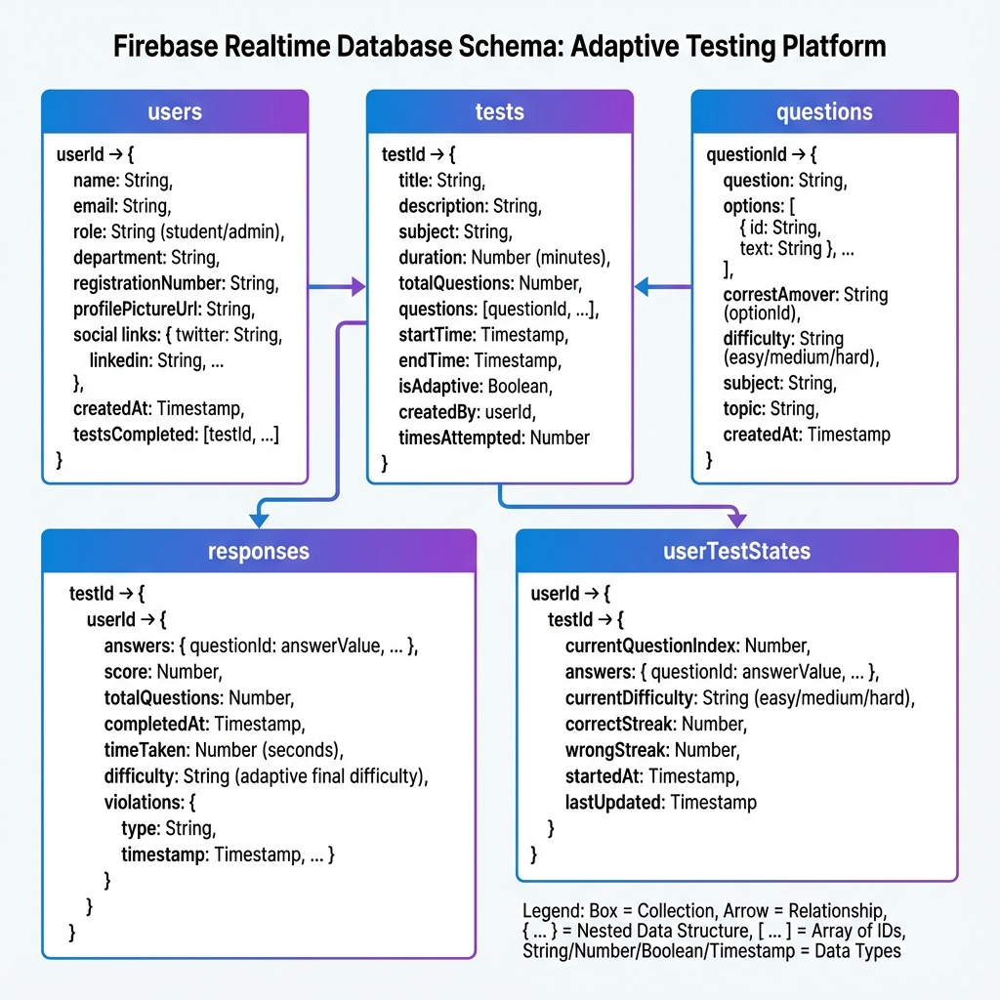

# OPTIMUM - System Architecture

## Table of Contents
- [Overview](#overview)
- [System Architecture](#system-architecture)
- [Component Architecture](#component-architecture)
- [Database Schema](#database-schema)
- [Technology Stack](#technology-stack)
- [Security Architecture](#security-architecture)

---

## Overview

OPTIMUM is a modern, cloud-based adaptive testing platform built on a serverless architecture using Firebase as the backend infrastructure and React as the frontend framework.

---

## System Architecture

### High-Level Architecture

```
┌─────────────────────────────────────────────────────────────────────┐
│                          Client Layer (Browser)                      │
│  ┌──────────────────────────────────────────────────────────────┐   │
│  │                    React Application (SPA)                    │   │
│  │  ┌────────────┐  ┌────────────┐  ┌────────────┐             │   │
│  │  │  Student   │  │   Admin    │  │    Auth    │             │   │
│  │  │  Interface │  │  Interface │  │  Interface │             │   │
│  │  └────────────┘  └────────────┘  └────────────┘             │   │
│  │                                                                │   │
│  │  ┌──────────────────────────────────────────────────────┐    │   │
│  │  │         State Management (Context API)                │    │   │
│  │  └──────────────────────────────────────────────────────┘    │   │
│  │                                                                │   │
│  │  ┌──────────────────────────────────────────────────────┐    │   │
│  │  │         Service Layer (Business Logic)                │    │   │
│  │  │  • Adaptive Test Engine                              │    │   │
│  │  │  • Performance Tracking                               │    │   │
│  │  │  • AI Question Generation                             │    │   │
│  │  │  • Proctoring System                                  │    │   │
│  │  └──────────────────────────────────────────────────────┘    │   │
│  └──────────────────────────────────────────────────────────────┘   │
└─────────────────────────────────────────────────────────────────────┘
                                    │
                                    │ HTTPS/WSS
                                    ▼
┌─────────────────────────────────────────────────────────────────────┐
│                         Firebase Platform (BaaS)                     │
│  ┌──────────────┐  ┌──────────────┐  ┌──────────────┐              │
│  │   Firebase   │  │   Realtime   │  │   Firebase   │              │
│  │     Auth     │  │   Database   │  │   Storage    │              │
│  │              │  │              │  │              │              │
│  │  • Email/Pwd │  │  • NoSQL DB  │  │  • File      │              │
│  │  • Google    │  │  • Real-time │  │    Storage   │              │
│  │  • Sessions  │  │  • Sync      │  │  • CDN       │              │
│  └──────────────┘  └──────────────┘  └──────────────┘              │
└─────────────────────────────────────────────────────────────────────┘
                                    │
                                    │ API Calls
                                    ▼
┌─────────────────────────────────────────────────────────────────────┐
│                        External Services                             │
│  ┌──────────────┐  ┌──────────────┐                                 │
│  │  OpenRouter  │  │   EmailJS    │                                 │
│  │      AI      │  │              │                                 │
│  │              │  │  • Contact   │                                 │
│  │  • DeepSeek  │  │    Form      │                                 │
│  │  • GPT-4     │  │  • Email     │                                 │
│  │  • Claude    │  │    Verify    │                                 │
│  └──────────────┘  └──────────────┘                                 │
└─────────────────────────────────────────────────────────────────────┘
```

---

## Component Architecture

### Frontend Component Hierarchy

```
App (Root)
│
├── AuthContext Provider
│   ├── currentUser
│   ├── userData
│   └── auth methods
│
├── Router
│   │
│   ├── Public Routes
│   │   ├── Home
│   │   ├── AboutUs
│   │   ├── ContactUs
│   │   └── PublicDashboard
│   │
│   ├── Auth Routes
│   │   ├── Login
│   │   │   ├── LoginForm
│   │   │   └── AdminLoginForm
│   │   └── Register
│   │       ├── RegisterForm
│   │       └── AdminRegisterForm
│   │
│   ├── Student Routes (Protected)
│   │   ├── Dashboard
│   │   │   ├── TestCard[]
│   │   │   ├── PerformanceTracker
│   │   │   └── QuickStats
│   │   │
│   │   ├── TestInterface
│   │   │   ├── QuestionDisplay
│   │   │   ├── OptionsList
│   │   │   ├── NavigationButtons
│   │   │   ├── Timer
│   │   │   └── ProctoringMonitor
│   │   │
│   │   ├── TestResult
│   │   │   ├── ScoreCard
│   │   │   ├── PerformanceMetrics
│   │   │   ├── AnswerReviewPanel
│   │   │   └── PDFDownload
│   │   │
│   │   ├── Profile
│   │   │   ├── ProfileHeader
│   │   │   ├── EditForm
│   │   │   ├── SocialLinks
│   │   │   ├── PerformanceCharts
│   │   │   └── AvatarModal
│   │   │
│   │   └── Leaderboard
│   │       ├── RankingTable
│   │       ├── FilterControls
│   │       └── UserHighlight
│   │
│   └── Admin Routes (Protected)
│       ├── AdminDashboard
│       │   ├── StatsCards
│       │   ├── RecentActivity
│       │   └── QuickActions
│       │
│       ├── TestManagement
│       │   ├── TestList
│       │   ├── CreateTestModal
│       │   │   ├── ManualEntry
│       │   │   ├── AIGeneration
│       │   │   └── BulkImport
│       │   └── EditTestModal
│       │
│       ├── AdminManagement
│       │   ├── AdminList
│       │   └── CreateAdminForm
│       │
│       └── ResultsView
│           ├── StudentList
│           ├── TestSelector
│           ├── PerformanceCharts
│           └── StudentProgressModal
│
└── Common Components
    ├── Navbar
    ├── LoadingSkeleton
    ├── DifficultyBadge
    └── ProtectedRoute
```

### Service Layer Architecture

```
Service Layer
│
├── adaptiveTestService.ts
│   ├── initializeAdaptiveTest()
│   ├── getNextQuestion()
│   ├── updateDifficulty()
│   ├── calculateScore()
│   └── saveTestState()
│
├── aiService.ts
│   ├── extractTextFromPDF()
│   ├── generateQuestions()
│   ├── parseAIResponse()
│   └── validateQuestions()
│
├── performanceTrackingService.ts
│   ├── getPerformanceMetrics()
│   ├── calculateTrends()
│   ├── getTestHistory()
│   └── generateInsights()
│
├── emailService.ts
│   ├── sendVerificationCode()
│   ├── verifyCode()
│   └── updateEmail()
│
└── registrationValidation.ts
    ├── validateEmail()
    ├── validateRegistrationNumber()
    └── checkDuplicates()
```

---

## Database Schema

### Firebase Realtime Database Structure



**JSON Structure:**

```json
{
  "users": {
    "userId": {
      "name": "string",
      "email": "string",
      "role": "student | admin",
      "department": "string",
      "registrationNumber": "string",
      "profilePictureUrl": "string?",
      "github": "string?",
      "linkedin": "string?",
      "portfolio": "string?",
      "phone": "string?",
      "leetcode": "string?",
      "hackerrank": "string?",
      "createdAt": "timestamp",
      "testsCompleted": "number"
    }
  },
  
  "tests": {
    "testId": {
      "title": "string",
      "description": "string",
      "subject": "string",
      "duration": "number (minutes)",
      "totalQuestions": "number",
      "questions": ["questionId"],
      "startTime": "ISO string",
      "endTime": "ISO string",
      "isAdaptive": "boolean",
      "createdBy": "userId",
      "createdAt": "timestamp",
      "timesAttempted": "number"
    }
  },
  
  "questions": {
    "questionId": {
      "question": "string",
      "options": ["string", "string", "string", "string"],
      "correctAnswer": "number (0-3)",
      "difficulty": "easy | medium | hard",
      "subject": "string?",
      "topic": "string?",
      "createdAt": "timestamp"
    }
  },
  
  "responses": {
    "testId": {
      "userId": {
        "answers": ["number"],
        "score": "number",
        "totalQuestions": "number",
        "completedAt": "timestamp",
        "timeTaken": "number (seconds)",
        "difficulty": "easy | medium | hard?",
        "violations": "number?"
      }
    }
  },
  
  "userTestStates": {
    "userId": {
      "testId": {
        "currentQuestionIndex": "number",
        "answers": ["number"],
        "currentDifficulty": "easy | medium | hard",
        "correctStreak": "number",
        "wrongStreak": "number",
        "startedAt": "timestamp",
        "lastUpdated": "timestamp"
      }
    }
  }
}
```

### Database Indexes

**Recommended Indexes:**
- `users/role` - For filtering by user type
- `users/department` - For leaderboard filtering
- `tests/startTime` - For sorting active tests
- `responses/completedAt` - For performance tracking

---

## Technology Stack

### Frontend Technologies

| Technology | Version | Purpose |
|------------|---------|---------|
| React | 18.3.1 | UI Framework |
| TypeScript | 5.5.3 | Type Safety |
| Vite | 5.4.2 | Build Tool |
| TailwindCSS | 3.4.1 | Styling |
| React Router | 7.7.1 | Routing |
| Chart.js | 4.5.0 | Data Visualization |
| Lucide React | Latest | Icons |

### Backend Services

| Service | Purpose |
|---------|---------|
| Firebase Auth | User authentication |
| Firebase Realtime DB | Data storage & sync |
| Firebase Storage | File storage |
| OpenRouter AI | Question generation |
| EmailJS | Email services |

### Development Tools

| Tool | Purpose |
|------|---------|
| ESLint | Code linting |
| TypeScript ESLint | TS-specific linting |
| PostCSS | CSS processing |
| Autoprefixer | CSS compatibility |

---

## Security Architecture

### Authentication Flow

```
User Login Request
       │
       ▼
Firebase Authentication
       │
       ├─► Email/Password Validation
       ├─► Google OAuth (optional)
       │
       ▼
Generate JWT Token
       │
       ▼
Store in Session
       │
       ▼
Fetch User Data from DB
       │
       ├─► Check Role (student/admin)
       ├─► Verify Email Status
       │
       ▼
Route to Dashboard
```

### Authorization Levels

**Public Access:**
- Home page
- About page
- Contact page
- Public dashboard (read-only)

**Student Access:**
- View available tests
- Take tests
- View results
- Access profile
- View leaderboard

**Admin Access:**
- All student permissions
- Create/edit/delete tests
- Create questions
- View all student results
- Manage admin users
- Access analytics

### Database Security Rules

**Key Security Principles:**
1. **Authentication Required**: All database access requires authentication
2. **Role-Based Access**: Admin-only operations protected by role checks
3. **User Isolation**: Students can only access their own data
4. **Write Protection**: Test and question data protected from student modification

---

## Performance Optimizations

### Frontend Optimizations

1. **Code Splitting**: Route-based lazy loading
2. **Memoization**: React.memo for expensive components
3. **Virtual Scrolling**: For large lists (leaderboard, questions)
4. **Image Optimization**: WebP format, lazy loading
5. **Bundle Optimization**: Tree shaking, minification

### Database Optimizations

1. **Denormalization**: Store computed values (scores, averages)
2. **Indexing**: Strategic indexes for common queries
3. **Pagination**: Limit data fetched per request
4. **Caching**: Local storage for static data
5. **Real-time Listeners**: Selective subscriptions

### Network Optimizations

1. **CDN**: Static assets served via Firebase CDN
2. **Compression**: Gzip/Brotli compression
3. **HTTP/2**: Multiplexing support
4. **Prefetching**: Critical resources preloaded
5. **Service Worker**: Offline capability (future)

---

## Scalability Considerations

### Current Capacity

- **Concurrent Users**: 1000+ (Firebase free tier)
- **Database Size**: 1GB (Firebase free tier)
- **Storage**: 5GB (Firebase free tier)
- **API Calls**: 50K/day (OpenRouter free tier)

### Scaling Strategy

**Horizontal Scaling:**
- Firebase automatically scales
- No server management required
- Pay-as-you-grow pricing

**Vertical Scaling:**
- Upgrade Firebase plan
- Increase OpenRouter quota
- Add caching layer (Redis)

**Future Enhancements:**
- Implement CDN for assets
- Add database sharding
- Implement queue system for AI generation
- Add monitoring and alerting

---

## Deployment Architecture

```
Developer
    │
    ├─► Git Push to GitHub
    │
    ▼
GitHub Repository
    │
    ├─► Webhook Trigger
    │
    ▼
Vercel/Netlify CI/CD
    │
    ├─► npm install
    ├─► npm run build
    ├─► Environment Variables Injection
    │
    ▼
Build Artifacts (dist/)
    │
    ├─► Deploy to CDN
    ├─► Configure Routing
    │
    ▼
Production Environment
    │
    ├─► HTTPS Enabled
    ├─► Custom Domain
    └─► Global CDN Distribution
```

---

## Monitoring & Analytics

### Application Monitoring

- **Firebase Analytics**: User engagement tracking
- **Performance Monitoring**: Page load times
- **Error Tracking**: Runtime error logging
- **User Behavior**: Test completion rates

### Metrics Tracked

1. **User Metrics**:
   - Daily/Monthly Active Users
   - Registration rate
   - Login frequency

2. **Test Metrics**:
   - Tests created
   - Tests attempted
   - Completion rate
   - Average scores

3. **Performance Metrics**:
   - Page load time
   - API response time
   - Database query time
   - Error rate

---

## Disaster Recovery

### Backup Strategy

**Firebase Automatic Backups:**
- Daily automated backups
- 30-day retention
- Point-in-time recovery

**Manual Backups:**
- Export database JSON
- Store in version control
- Document restoration process

### Recovery Procedures

1. **Data Loss**: Restore from Firebase backup
2. **Service Outage**: Firebase 99.95% uptime SLA
3. **Code Issues**: Git revert to stable version
4. **Security Breach**: Rotate API keys, audit logs

---

## Future Architecture Enhancements

### Planned Improvements

1. **Microservices**: Separate AI service
2. **Caching Layer**: Redis for frequently accessed data
3. **Message Queue**: RabbitMQ for async tasks
4. **GraphQL**: Replace REST with GraphQL
5. **WebSockets**: Real-time collaboration features
6. **Mobile Apps**: React Native applications
7. **Analytics Dashboard**: Advanced reporting
8. **Machine Learning**: Personalized recommendations

---

## Conclusion

OPTIMUM's architecture is designed for:
- **Scalability**: Cloud-native, serverless design
- **Security**: Multi-layer authentication and authorization
- **Performance**: Optimized for speed and efficiency
- **Maintainability**: Clean separation of concerns
- **Extensibility**: Modular design for future enhancements
