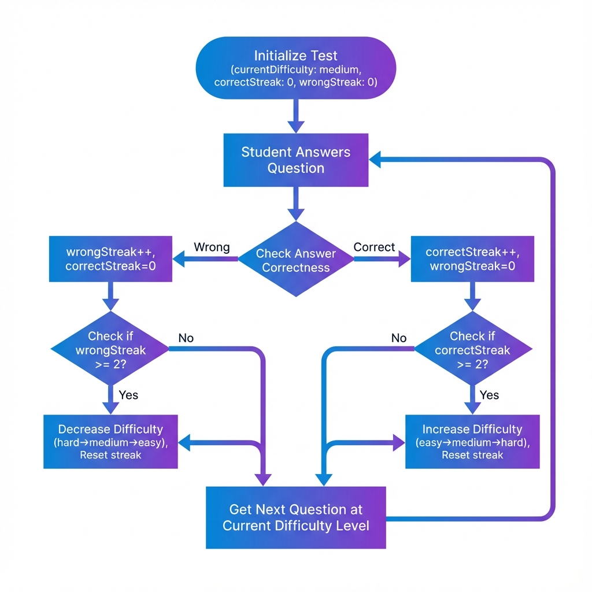
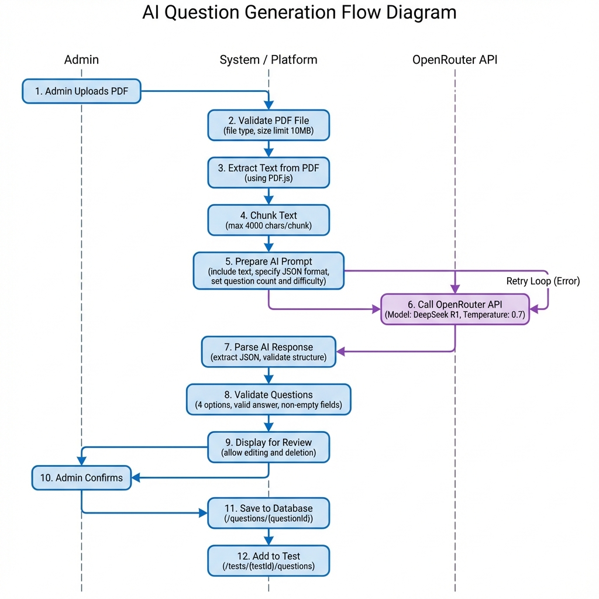

# OPTIMUM - Data Flow Diagrams

## Table of Contents
- [User Authentication Flow](#user-authentication-flow)
- [Test Taking Flow](#test-taking-flow)
- [Adaptive Testing Flow](#adaptive-testing-flow)
- [AI Question Generation Flow](#ai-question-generation-flow)
- [Performance Tracking Flow](#performance-tracking-flow)
- [Admin Test Creation Flow](#admin-test-creation-flow)

---

## User Authentication Flow

### Student Registration

```
┌─────────────┐
│   Student   │
│   Visits    │
│  Register   │
└──────┬──────┘
       │
       ▼
┌─────────────────────────────┐
│  Fill Registration Form     │
│  • Name                     │
│  • Email                    │
│  • Password                 │
│  • Department               │
│  • Registration Number      │
└──────┬──────────────────────┘
       │
       ▼
┌─────────────────────────────┐
│  Client-side Validation     │
│  • Email format             │
│  • Password strength        │
│  • Required fields          │
└──────┬──────────────────────┘
       │
       ▼
┌─────────────────────────────┐
│  Check Email Uniqueness     │
│  (Firebase Database Query)  │
└──────┬──────────────────────┘
       │
       ├─► Email Exists ──► Show Error
       │
       ▼
┌─────────────────────────────┐
│  Create Firebase Auth User  │
│  (Email/Password)           │
└──────┬──────────────────────┘
       │
       ▼
┌─────────────────────────────┐
│  Create User Record in DB   │
│  /users/{userId}            │
│  • role: "student"          │
│  • All form data            │
└──────┬──────────────────────┘
       │
       ▼
┌─────────────────────────────┐
│  Auto Login & Redirect      │
│  → Student Dashboard        │
└─────────────────────────────┘
```

### Login Flow

```
┌─────────────┐
│    User     │
│   Enters    │
│ Credentials │
└──────┬──────┘
       │
       ▼
┌─────────────────────────────┐
│  Firebase Authentication    │
│  signInWithEmailAndPassword │
└──────┬──────────────────────┘
       │
       ├─► Invalid ──► Show Error
       │
       ▼
┌─────────────────────────────┐
│  Fetch User Data from DB    │
│  /users/{userId}            │
└──────┬──────────────────────┘
       │
       ▼
┌─────────────────────────────┐
│  Check User Role            │
└──────┬──────────────────────┘
       │
       ├─► role === "admin" ──► Admin Dashboard
       │
       └─► role === "student" ──► Student Dashboard
```

---

## Test Taking Flow

### Complete Test Flow

```
┌─────────────┐
│   Student   │
│   Selects   │
│    Test     │
└──────┬──────┘
       │
       ▼
┌─────────────────────────────┐
│  Check Test Availability    │
│  • Start/End time           │
│  • Already attempted?       │
└──────┬──────────────────────┘
       │
       ├─► Not Available ──► Show Message
       │
       ▼
┌─────────────────────────────┐
│  Load Test Data             │
│  • Test details             │
│  • Questions                │
│  • Configuration            │
└──────┬──────────────────────┘
       │
       ▼
┌─────────────────────────────┐
│  Initialize Test State      │
│  • Start timer              │
│  • Enable proctoring        │
│  • Create state in DB       │
└──────┬──────────────────────┘
       │
       ▼
┌─────────────────────────────┐
│  Display First Question     │
└──────┬──────────────────────┘
       │
       ▼
    ┌──────────────────────────┐
    │   Answer Question Loop   │
    │                          │
    │  ┌────────────────────┐  │
    │  │ Student Selects    │  │
    │  │ Answer             │  │
    │  └─────────┬──────────┘  │
    │            │              │
    │            ▼              │
    │  ┌────────────────────┐  │
    │  │ Save Answer        │  │
    │  │ (Local State +     │  │
    │  │  Database)         │  │
    │  └─────────┬──────────┘  │
    │            │              │
    │            ▼              │
    │  ┌────────────────────┐  │
    │  │ Is Adaptive?       │  │
    │  └─────────┬──────────┘  │
    │            │              │
    │  Yes ──────┼────► Adjust Difficulty
    │            │              │
    │            ▼              │
    │  ┌────────────────────┐  │
    │  │ Next Question      │  │
    │  └─────────┬──────────┘  │
    │            │              │
    │  ┌─────────┴──────────┐  │
    │  │ More Questions?    │  │
    │  └─────────┬──────────┘  │
    │            │              │
    │  Yes ──────┘              │
    │            │              │
    └────────────┼──────────────┘
                 │ No
                 ▼
┌─────────────────────────────┐
│  Calculate Final Score      │
│  • Weighted scoring         │
│  • Time bonus (if any)      │
└──────┬──────────────────────┘
       │
       ▼
┌─────────────────────────────┐
│  Save Results to Database   │
│  /responses/{testId}/{uid}  │
└──────┬──────────────────────┘
       │
       ▼
┌─────────────────────────────┐
│  Update User Stats          │
│  • Tests completed          │
│  • Average score            │
└──────┬──────────────────────┘
       │
       ▼
┌─────────────────────────────┐
│  Redirect to Results Page   │
└─────────────────────────────┘
```

---

## Adaptive Testing Flow

### Difficulty Adjustment Algorithm



**Detailed Flow:**

```
┌─────────────────────────────┐
│  Initialize Test            │
│  • currentDifficulty: medium│
│  • correctStreak: 0         │
│  • wrongStreak: 0           │
└──────┬──────────────────────┘
       │
       ▼
┌─────────────────────────────┐
│  Student Answers Question   │
└──────┬──────────────────────┘
       │
       ▼
┌─────────────────────────────┐
│  Check Answer Correctness   │
└──────┬──────────────────────┘
       │
       ├─► Correct
       │   │
       │   ▼
       │   ┌─────────────────────────────┐
       │   │  correctStreak++            │
       │   │  wrongStreak = 0            │
       │   └──────┬──────────────────────┘
       │          │
       │          ▼
       │   ┌─────────────────────────────┐
       │   │  correctStreak >= 2?        │
       │   └──────┬──────────────────────┘
       │          │
       │   Yes ───┼──► Increase Difficulty
       │          │    • easy → medium
       │          │    • medium → hard
       │          │    • hard → hard
       │          │    Reset correctStreak
       │          │
       │   No ────┘
       │
       └─► Wrong
           │
           ▼
           ┌─────────────────────────────┐
           │  wrongStreak++              │
           │  correctStreak = 0          │
           └──────┬──────────────────────┘
                  │
                  ▼
           ┌─────────────────────────────┐
           │  wrongStreak >= 2?          │
           └──────┬──────────────────────┘
                  │
           Yes ───┼──► Decrease Difficulty
                  │    • hard → medium
                  │    • medium → easy
                  │    • easy → easy
                  │    Reset wrongStreak
                  │
           No ────┘
                  │
                  ▼
           ┌─────────────────────────────┐
           │  Get Next Question at       │
           │  Current Difficulty Level   │
           └─────────────────────────────┘
```

### Weighted Scoring

```
For each answered question:

┌─────────────────────────────┐
│  Get Question Difficulty    │
└──────┬──────────────────────┘
       │
       ▼
┌─────────────────────────────┐
│  Assign Points:             │
│  • Easy: 1 point            │
│  • Medium: 2 points         │
│  • Hard: 3 points           │
└──────┬──────────────────────┘
       │
       ▼
┌─────────────────────────────┐
│  Is Answer Correct?         │
└──────┬──────────────────────┘
       │
       ├─► Yes ──► Add points to score
       │
       └─► No ──► Add 0 points
       
Final Score = Sum of all points earned
```

---

## AI Question Generation Flow



**Detailed Process:**

```
┌─────────────┐
│    Admin    │
│   Uploads   │
│     PDF     │
└──────┬──────┘
       │
       ▼
┌─────────────────────────────┐
│  Validate PDF File          │
│  • File type check          │
│  • Size limit (10MB)        │
└──────┬──────────────────────┘
       │
       ▼
┌─────────────────────────────┐
│  Extract Text from PDF      │
│  (PDF.js library)           │
└──────┬──────────────────────┘
       │
       ▼
┌─────────────────────────────┐
│  Chunk Text                 │
│  • Max 4000 chars/chunk     │
│  • Preserve context         │
└──────┬──────────────────────┘
       │
       ▼
┌─────────────────────────────┐
│  Prepare AI Prompt          │
│  • Include text chunk       │
│  • Specify format (JSON)    │
│  • Set question count       │
│  • Set difficulty           │
└──────┬──────────────────────┘
       │
       ▼
┌─────────────────────────────┐
│  Call OpenRouter API        │
│  • Model: DeepSeek R1       │
│  • Temperature: 0.7         │
└──────┬──────────────────────┘
       │
       ├─► API Error ──► Retry (max 3)
       │
       ▼
┌─────────────────────────────┐
│  Parse AI Response          │
│  • Extract JSON             │
│  • Validate structure       │
└──────┬──────────────────────┘
       │
       ▼
┌─────────────────────────────┐
│  Validate Questions         │
│  • 4 options per question   │
│  • Valid correct answer     │
│  • Non-empty fields         │
└──────┬──────────────────────┘
       │
       ▼
┌─────────────────────────────┐
│  Display for Review         │
│  • Allow editing            │
│  • Allow deletion           │
└──────┬──────────────────────┘
       │
       ▼
┌─────────────────────────────┐
│  Admin Confirms             │
└──────┬──────────────────────┘
       │
       ▼
┌─────────────────────────────┐
│  Save to Database           │
│  /questions/{questionId}    │
└──────┬──────────────────────┘
       │
       ▼
┌─────────────────────────────┐
│  Add to Test                │
│  /tests/{testId}/questions  │
└─────────────────────────────┘
```

---

## Performance Tracking Flow

```
┌─────────────┐
│   Student   │
│   Visits    │
│   Profile   │
└──────┬──────┘
       │
       ▼
┌─────────────────────────────┐
│  Fetch User Data            │
│  /users/{userId}            │
└──────┬──────────────────────┘
       │
       ▼
┌─────────────────────────────┐
│  Fetch All Test Results     │
│  /responses/*/{userId}      │
└──────┬──────────────────────┘
       │
       ▼
┌─────────────────────────────┐
│  Fetch Test Metadata        │
│  /tests/*                   │
└──────┬──────────────────────┘
       │
       ▼
┌─────────────────────────────┐
│  Calculate Metrics          │
│  ┌─────────────────────┐    │
│  │ Average Score       │    │
│  │ = Σ(scores) / count │    │
│  └─────────────────────┘    │
│  ┌─────────────────────┐    │
│  │ Highest Score       │    │
│  │ = max(scores)       │    │
│  └─────────────────────┘    │
│  ┌─────────────────────┐    │
│  │ Lowest Score        │    │
│  │ = min(scores)       │    │
│  └─────────────────────┘    │
│  ┌─────────────────────┐    │
│  │ Tests Completed     │    │
│  │ = count(results)    │    │
│  └─────────────────────┘    │
└──────┬──────────────────────┘
       │
       ▼
┌─────────────────────────────┐
│  Generate Chart Data        │
│  • Line chart: Score trend  │
│  • Pie chart: Distribution  │
└──────┬──────────────────────┘
       │
       ▼
┌─────────────────────────────┐
│  Render Performance UI      │
│  • Stats cards              │
│  • Charts (Chart.js)        │
│  • Test history table       │
└─────────────────────────────┘
```

---

## Admin Test Creation Flow

### Manual Test Creation

```
┌─────────────┐
│    Admin    │
│   Clicks    │
│ Create Test │
└──────┬──────┘
       │
       ▼
┌─────────────────────────────┐
│  Open Create Test Modal     │
└──────┬──────────────────────┘
       │
       ▼
┌─────────────────────────────┐
│  Fill Test Details          │
│  • Title                    │
│  • Description              │
│  • Subject                  │
│  • Duration                 │
│  • Start/End time           │
│  • Adaptive mode toggle     │
└──────┬──────────────────────┘
       │
       ▼
┌─────────────────────────────┐
│  Choose Question Input      │
│  Method                     │
└──────┬──────────────────────┘
       │
       ├─► Manual Entry
       │   │
       │   ▼
       │   ┌─────────────────────────────┐
       │   │  Add Questions One by One   │
       │   │  • Question text            │
       │   │  • 4 options                │
       │   │  • Correct answer           │
       │   │  • Difficulty (if adaptive) │
       │   └──────┬──────────────────────┘
       │          │
       │          └──► Save to questions[]
       │
       ├─► AI Generation
       │   │
       │   ▼
       │   ┌─────────────────────────────┐
       │   │  Upload PDF                 │
       │   │  Configure AI settings      │
       │   └──────┬──────────────────────┘
       │          │
       │          ▼
       │   ┌─────────────────────────────┐
       │   │  AI Generates Questions     │
       │   │  (See AI Flow above)        │
       │   └──────┬──────────────────────┘
       │          │
       │          └──► Review & Add to test
       │
       └─► Bulk Import
           │
           ▼
           ┌─────────────────────────────┐
           │  Upload Excel/CSV           │
           │  Parse file                 │
           └──────┬──────────────────────┘
                  │
                  ▼
           ┌─────────────────────────────┐
           │  Validate Data              │
           │  • Required columns         │
           │  • Data types               │
           └──────┬──────────────────────┘
                  │
                  └──► Import all questions
                  │
                  ▼
┌─────────────────────────────┐
│  Save Questions to DB       │
│  /questions/{questionId}    │
└──────┬──────────────────────┘
       │
       ▼
┌─────────────────────────────┐
│  Create Test Record         │
│  /tests/{testId}            │
│  • Test details             │
│  • Question IDs array       │
└──────┬──────────────────────┘
       │
       ▼
┌─────────────────────────────┐
│  Close Modal                │
│  Refresh Test List          │
└─────────────────────────────┘
```

---

## Proctoring Flow

```
┌─────────────────────────────┐
│  Test Starts                │
│  Initialize Proctoring      │
└──────┬──────────────────────┘
       │
       ▼
┌─────────────────────────────┐
│  Request Fullscreen         │
└──────┬──────────────────────┘
       │
       ├─► Denied ──► Show Warning
       │
       ▼
┌─────────────────────────────┐
│  Start Monitoring           │
│  • Tab visibility           │
│  • Fullscreen status        │
└──────┬──────────────────────┘
       │
       ▼
    ┌──────────────────────────┐
    │   Monitoring Loop        │
    │                          │
    │  ┌────────────────────┐  │
    │  │ Detect Event       │  │
    │  │ • Tab switch       │  │
    │  │ • Exit fullscreen  │  │
    │  └─────────┬──────────┘  │
    │            │              │
    │            ▼              │
    │  ┌────────────────────┐  │
    │  │ Increment          │  │
    │  │ Violation Count    │  │
    │  └─────────┬──────────┘  │
    │            │              │
    │            ▼              │
    │  ┌────────────────────┐  │
    │  │ Show Warning       │  │
    │  │ Modal              │  │
    │  └─────────┬──────────┘  │
    │            │              │
    │            ▼              │
    │  ┌────────────────────┐  │
    │  │ violations >= 3?   │  │
    │  └─────────┬──────────┘  │
    │            │              │
    │  Yes ──────┼────► Auto-submit Test
    │            │              │
    │  No ───────┘              │
    │            │              │
    └────────────┼──────────────┘
                 │
                 ▼
┌─────────────────────────────┐
│  Test Ends                  │
│  Save Violation Count       │
│  in Results                 │
└─────────────────────────────┘
```

---

## Real-time Data Synchronization

```
┌─────────────────────────────┐
│  Client Action              │
│  (e.g., Answer question)    │
└──────┬──────────────────────┘
       │
       ▼
┌─────────────────────────────┐
│  Update Local State         │
│  (React useState)           │
└──────┬──────────────────────┘
       │
       ▼
┌─────────────────────────────┐
│  Firebase Database Write    │
│  (set/update)               │
└──────┬──────────────────────┘
       │
       ▼
┌─────────────────────────────┐
│  Firebase Server            │
│  Processes Update           │
└──────┬──────────────────────┘
       │
       ▼
┌─────────────────────────────┐
│  Broadcast to All           │
│  Connected Clients          │
│  (WebSocket)                │
└──────┬──────────────────────┘
       │
       ▼
┌─────────────────────────────┐
│  Other Clients Receive      │
│  Update (if subscribed)     │
└──────┬──────────────────────┘
       │
       ▼
┌─────────────────────────────┐
│  Update UI                  │
│  (Real-time sync)           │
└─────────────────────────────┘
```

---

## Error Handling Flow

```
┌─────────────────────────────┐
│  User Action / API Call     │
└──────┬──────────────────────┘
       │
       ▼
┌─────────────────────────────┐
│  Try Operation              │
└──────┬──────────────────────┘
       │
       ├─► Success ──► Continue
       │
       ▼ Error
┌─────────────────────────────┐
│  Catch Error                │
└──────┬──────────────────────┘
       │
       ▼
┌─────────────────────────────┐
│  Log Error                  │
│  • Console.error            │
│  • Error details            │
└──────┬──────────────────────┘
       │
       ▼
┌─────────────────────────────┐
│  Determine Error Type       │
└──────┬──────────────────────┘
       │
       ├─► Network Error
       │   └──► Show "Check connection"
       │
       ├─► Auth Error
       │   └──► Redirect to login
       │
       ├─► Permission Error
       │   └──► Show "Access denied"
       │
       └─► Unknown Error
           └──► Show generic message
           
┌─────────────────────────────┐
│  Provide Recovery Option    │
│  • Retry button             │
│  • Go back button           │
│  • Contact support          │
└─────────────────────────────┘
```
